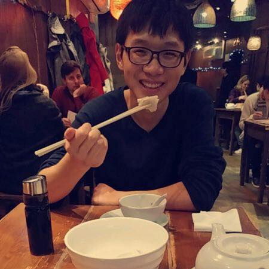

---
---

<link rel="stylesheet" href="styles.css" type="text/css">

 Much of my research has focused on understanding the nature of human cognition and behaviour. I have background in numerous academic fields (e.g., psychology, economics, neuroscience, and behavioural ecology) and firmly believe in an interdisciplinary approach towards scientific inquiry. My interest is initially grounded in dual-process reasoning theory but has gradually shifted to the evolution of psychological systems, with a special emphasis on biases in cognition, social learning, and gene-culture coevolution. Finally, I am eager to apply my research in the real world and drive positive changes.

My full CV is available [here](files/Wenjie Han-Resume.pdf)
