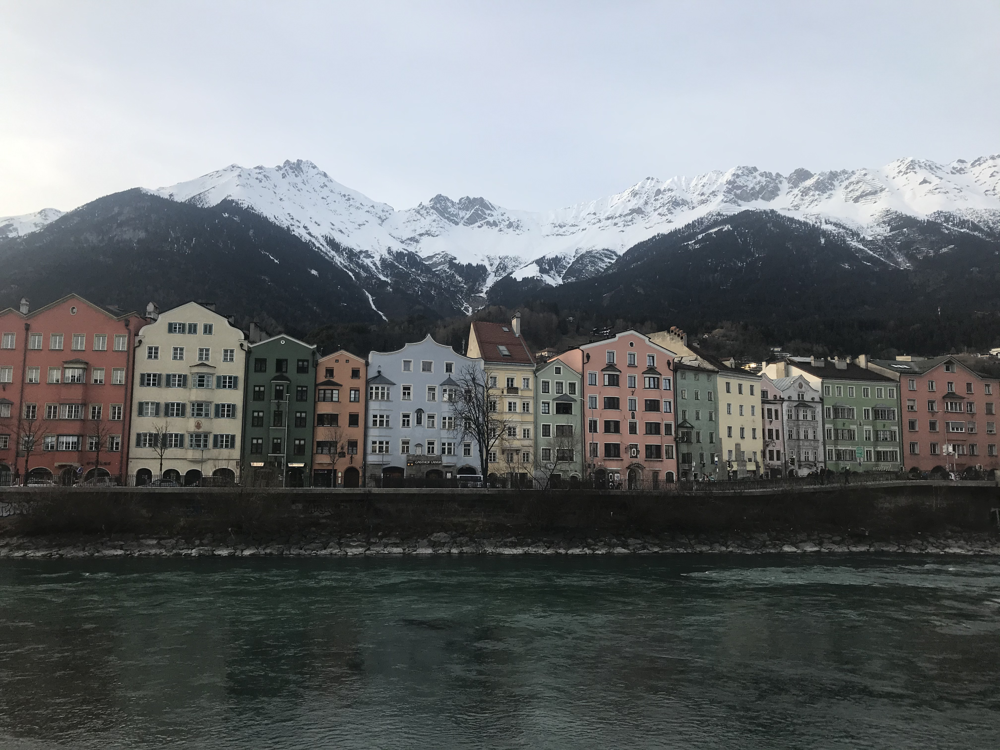

---

---

《满庭芳》北宋 （琴操）：山抹微云，天连衰草，画角声断斜阳。暂停征辔，聊共饮离觞。多少蓬莱旧侣，频回首烟霭茫茫。孤村里，寒烟万点，流水绕红墙。魂伤当此际，轻分罗带，暗解香囊，漫赢得青楼薄幸名狂。此去何时见也？襟袖上空有余香。伤心处，长城望断，灯火已昏黄。

<html>

<head>
<title>W3.CSS</title>
<meta name="viewport" content="width=device-width, initial-scale=1">
<meta content="text/html; charset=iso-8859-2" http-equiv="Content-Type">
<link rel="stylesheet" href="https://www.w3schools.com/w3css/4/w3.css">

</head>
<body>

  
  
  
  
  
  
  
  
  
  
  
  
  

</body>
</html>